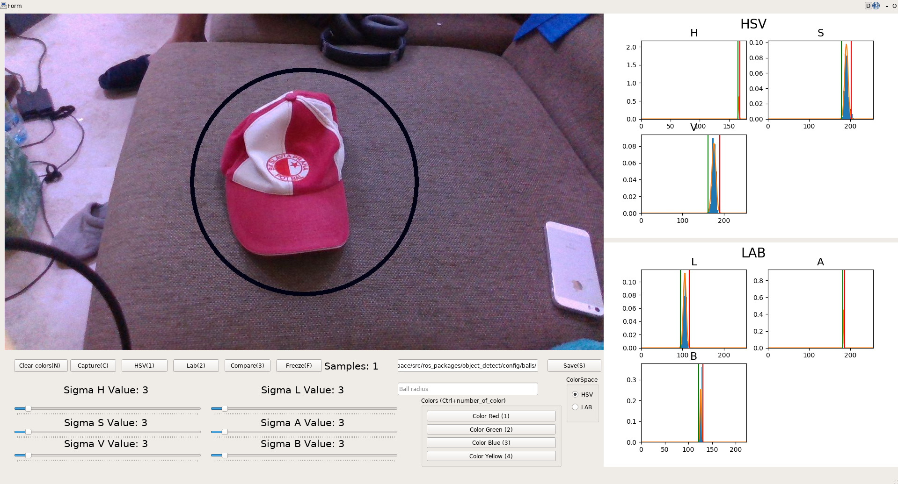

# Color picker GUI 

## How to use

The basics setup is provided via launch/gui.launch file. You need to specify your image_in topic, the rest topics are for the gui, so you don't need to change them.
You need to supply also a path were you want the saved files to be - save_dir param.

Also, to make your life easier prepare a color config file, you can see an example in this git repo called balloon_config.yaml - it provides names of the colors, so you don't need to write the names by yourself, just click the button. For this needs there is a config_path param.

## To launch computation into the drone terminal ( the realsense, or any camera that is specified in launch file should be working ): 
```
export $UAV_NAME=uav1; roslaunch balloon_color_picker compute.launch
```
## To launch gui type into your terminal, and you will have the gui to select colors: 
```
export $UAV_NAME=uav1; roslaunch balloon_color_picker gui.launch
```
To select color you can use:
 - Capture - will capture all the colors that are in the circle
 - Select - you can use your mouse to select area of interest on the picture
 - Freeze - freezes the image, so you can select area of interest
Feel free to use hotkeys for this, and submit bug report into issues, I'll try to fix them as soon as possible


<p align="center">
  
</p>
