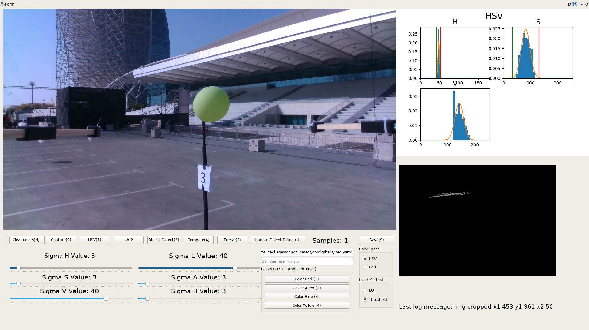

# Color picker GUI 

## How to use

The basics setup is provided via launch/gui.launch file. You need to specify your image_in topic, the rest topics are for the gui, so you don't need to change them.
You need to supply also a path were you want the saved files to be - save_dir param.

Also, to make your life easier prepare a color config file, you can see an example in this git repo called balloon_config.yaml - it provides names of the colors, so you don't need to write the names by yourself, just click the button. For this needs there is a config_path param.

## To launch computation into the drone terminal ( the realsense, or any camera that is specified in launch file should be working ): 
```
export $UAV_NAME=uav1; roslaunch balloon_color_picker compute.launch
```
## To launch gui type into your terminal, and you will have the gui to select colors: 
```
export $UAV_NAME=uav1; roslaunch balloon_color_picker gui.launch
```
To select color you can use:
 - Capture - will capture all the colors that are in the circle
 - Select - you can use your mouse to select area of interest on the picture
 - Freeze - freezes the image, so you can select area of interest
Feel free to use hotkeys for this, and submit bug report into issues, I'll try to fix them as soon as possible


<p align="center">
  
</p>

The GUI elements:
  - Video stream - a live video stream from a camera topic and the segmentation result using the selected color values.
  - Clear colors(N) - a button for  deleting the current color data. Can also be triggered by pressing "N" on the keyboard. 
  - HSV(1) - a button that changes current video stream from colorful image to the segmented image by the HSV color space. Can also be triggered by pressing "1" on the keyboard. 
  - Lab(2)  - a button that changes current video stream from colorful image to the segmented image by LAB. Can also be triggered by pressing "2" on the keyboard. 
  - Object Detect(3) - a button that changes current video stream from colorful image to the debug image from Object Detect. Can also be triggered by pressing "3" on the keyboard. 
  - Freeze(F) - a button that freezes the video stream. Can also be triggered by pressing "F" on the keyboard. 
  - Update Object Detect(U) - a button that sends the picked color LUT to the Object Detect package. Can also be triggered by pressing "U" on the keyboard. 
  - The current number of taken samples of the color. 
  - Save(S) - a button that saves the current picked color LUT to a file. Can also be triggered by pressing "S" on the keyboard.. 
  - A group of sliders for the H, S, V channels respectively. These sliders serve to change the allowed color range in the respective dimensions of the HSV color space.`k
  - A group of sliders for L,A,B channels correspondingly. These sliders serve to change the allowed color range in the respective dimensions of the LAB color space. 
  - Input bar for the destination of the file that will contain the resulting color data. 
  - Input bar for the diameter of the tracked object (expressed in centimeters).
  - A list of predefined color naming buttons. By pressing them, user can change the name of the resulting file. Can by also triggered by a combination of "Ctrl"+number of the desired color.
  - Buttons that change the current color space view.
  - The load method - buttons that specify what type of color data is send to Object Detect. 
  - The histogram block - a group of three histograms charts for each channel - H, S, V for HSV view and L, A, B for LAB view. 
  - 2D histogram of H,S channels in case of HSV view and A,B channels for LAB view. This area is used to select the color ranges for the LUT. 
  - A log message - verbose output of the last action. 
   

